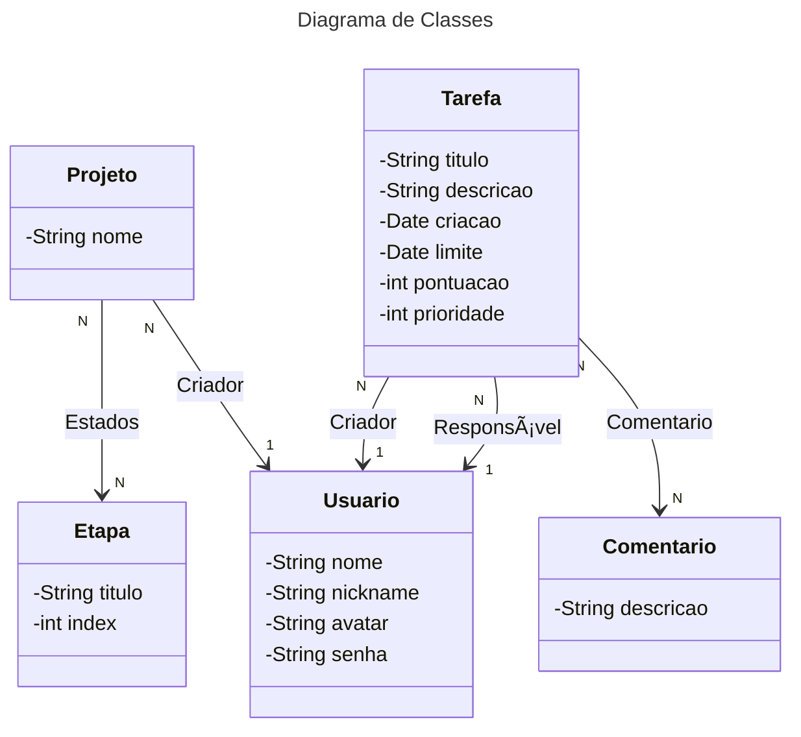

```mermaid 

---
title: Diagrama de Classes
---
classDiagram
    class Usuario {
    -String nome
    -String nickname
    -String avatar
    -String senha
    }

    class Projeto { 
    -String nome
    }


    class Etapa { 
    -String titulo
    -int index
    }

    class Tarefa { 
    -String titulo
    -String descricao
    -Date criacao
    -Date limite
    -int pontuacao
    -int prioridade
    }

    class Comentario { 
    -String descricao
    }

    Projeto "N" --> "N" Etapa : Estados
    Projeto "N" --> "1" Usuario : Criador


    Tarefa "N" --> "1" Usuario : Criador
    Tarefa "N" --> "1" Usuario : Responsável
    Tarefa "N" --> "N" Comentario : Comentario

```
