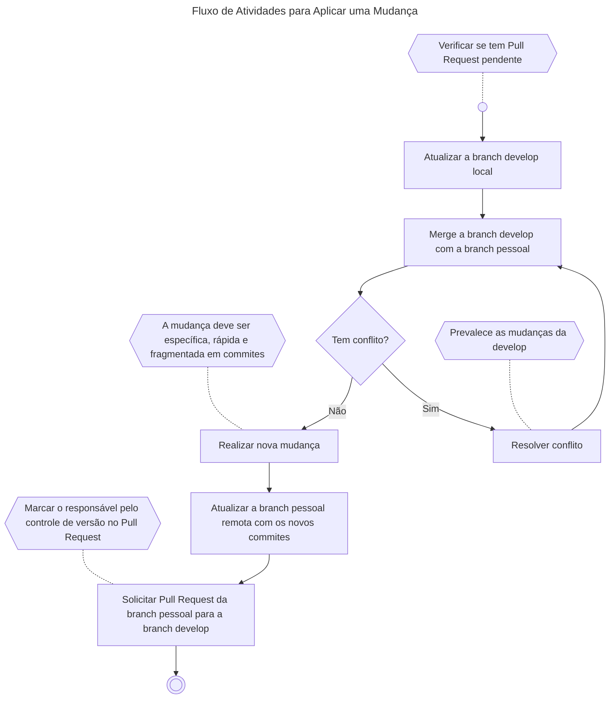

```mermaid
---
title: Fluxo de Atividades para Aplicar uma Mudança
---

flowchart TB

    comeco(( )) --> a01[Atualizar a branch develop local]
    note01{{Verificar se tem Pull Request pendente}} -.- comeco
    a01 --> a02[Merge a branch develop com a branch pessoal]
    a02 --> c01{Tem conflito?}
    note02{{A mudança deve ser específica, rápida e fragmentada em commites}} -.- a04
    c01 -- Não --> a04[Realizar nova mudança]
    a04 --> a05[Atualizar a branch pessoal remota com os novos commites]
    note03{{Marcar o responsável pelo controle de versão no Pull Request}} -.- a06
    a05 --> a06[Solicitar Pull Request da branch pessoal para a branch develop]
    a06 --> fim((( )))
    c01 -- Sim --> a03[Resolver conflito]
    a03 --> a02
    note04{{Prevalece as mudanças da develop}} -.- a03
    


```
